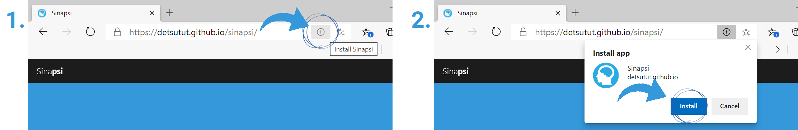
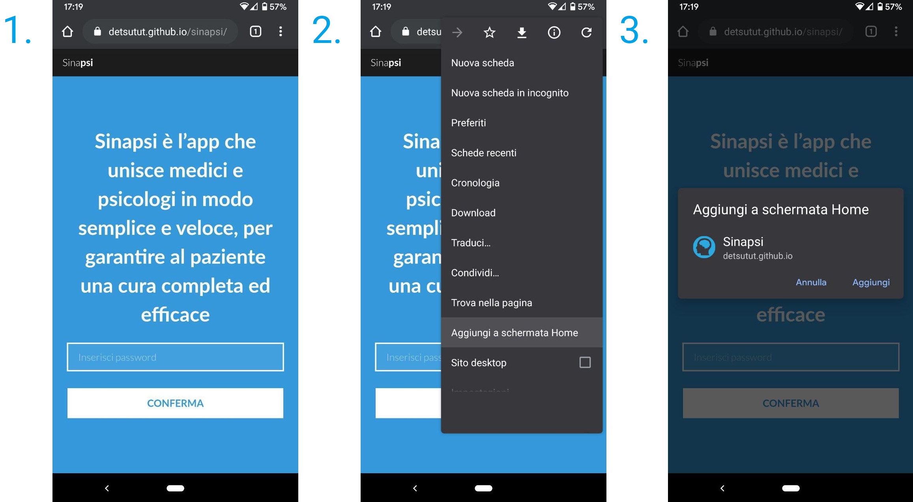

# Sina**psi**

## Description

**ITA:**
Ogni contatto nasce da un incontro, ogni incontro genera una connessione. Sinapsi è l’app che unisce medici e psicologi in modo semplice e veloce, per garantire al paziente una cura completa ed efficace.

**ENG:**
Every contact comes from a match, every match generates a connection. Sinapsi links physicians and psychologists in a simple and fast way, providing a complete and effective care for patients.

## Demo

Sinapsi provides services meant to be used from trusted family doctors only and is therefore protected by password.

A demo version for illustrative purposes [can be found here](https://detsutut.github.io/sinapsi/demo.html).

## Techincal Features

Sinapsi pushes the limits of static, serverless web pages implementing features and services that are usually meant to be coupled with backend servers.

### Progressive Web Application

Sinapsi has been upgraded to be PWA-compliant. This means the application can be installed on PCs and smartphones acting like a regular native app. Read more about progressive web apps [here](https://web.dev/progressive-web-apps/).

Follow the instructions below to install Sinapsi on your device.

#### Install on Windows

1.  Launch [Sinapsi](https://detsutut.github.io/sinapsi/) on your browser (Microsoft Edge, Google Chrome, Firefox or Safari)

2.  Click on the installation shortcut in the address bar as shown below:

  
  
Sinapsi installation from desktop browser (Microsoft Edge)

3. Done! Now Sinapsi will look and behave like a regular Windows app. You can find it in the app list, add it to your start menu, create shortcuts and uninstall it like any other Windows application.

  
  
Sinapsi desktop version

#### Install on Android

1.  Launch [Sinapsi](https://detsutut.github.io/sinapsi/) on Chrome

2.  Open tab settings in the top-right corner and click on the "Add to Home screen" option as shown below:

  
  
Sinapsi installation on Android

3. Done! Sinapsi will look now as a native Android app.

### Content Encryption

A static website like Sinapsi consists of files downloaded and processed by the visitor’s browser, therefore it's impossible to manage users access verification that needs to be handled server-side. 
However, it is still possible to implement some password protection using client-side scripting like [crypto-js](https://github.com/brix/crypto-js), a AES-256 encryption which encrypts the html page mixing its plain text representation and a user-defined password, which is mandatory to unencrypt the page content (see [Credits](https://github.com/detsutut/sinapsi#credits) section).

In Sinapsi, *premium* services and contents have been embedded in the encrypted html page, so that they can be accessed and used only by trusted family doctors who owns the password.

### Client-side Email Sender 

Sinapsi implements a client-side email sender for follow-ups and newsletters. This service usually requires the presence of a backend server, which isn't available in static web applications like Sinapsi. 
In order to get a server-like email sender without having an actual backend, we adapted [DWYL's solution](https://github.com/dwyl/learn-to-send-email-via-google-script-html-no-server) which uses an HTML form to send a message via email through Google App Script (see [Credits](https://github.com/detsutut/sinapsi#credits) section).

## Authors

* **Tommaso Buonocore** - *Author and Repository Maintainer* - [GitHub](https://github.com/detsutut), [LinkedIn](https://www.linkedin.com/in/tbuonocore/)
* **Andrea Avondo** - *Copyright Owner* 
* **Giulia Monardo** - *Copyright Owner*

## Credits

* [Robin Moisson](https://robinmoisson.github.io/staticrypt/) for AES-256 encryption system for static pages, based on [crypto-js](https://github.com/brix/crypto-js)
* [DWYL](https://github.com/dwyl/learn-to-send-email-via-google-script-html-no-server) for client-side email provider implementation for static pages using [Google App Script](https://www.google.com/script/start/)
* [Templated](https://templated.co) for the original template and design
* [Pexels](https://www.pexels.com) for all the images that are not personally owned

## License

This project is is provided under the terms of the [Creative Commons Attribution 3.0 Unported](https://creativecommons.org/licenses/by/3.0/) public license. See the [LICENSE.txt](LICENSE.txt) file for details.
